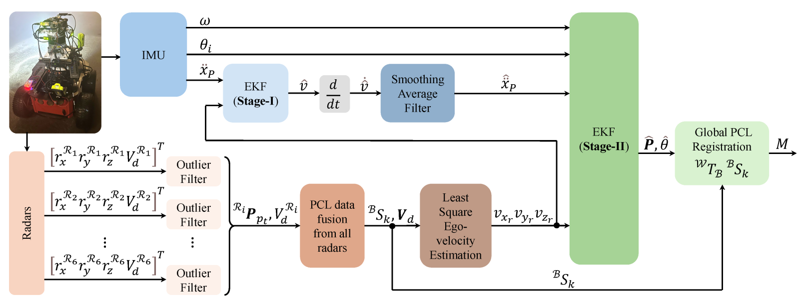
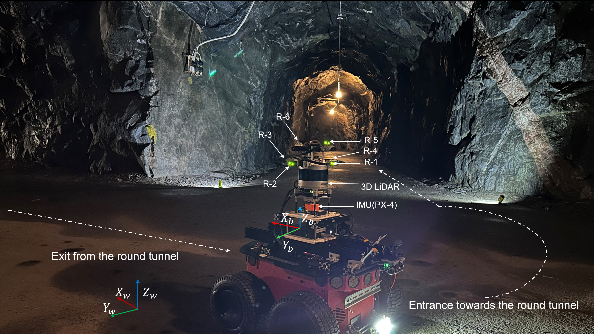
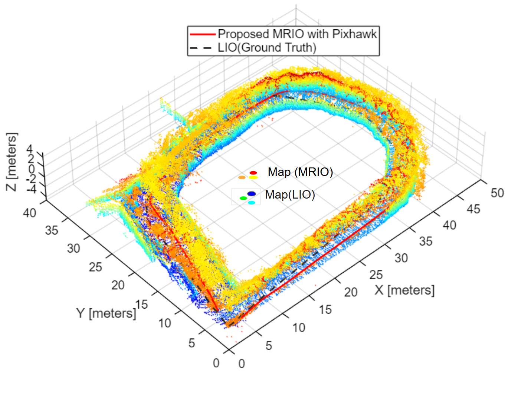
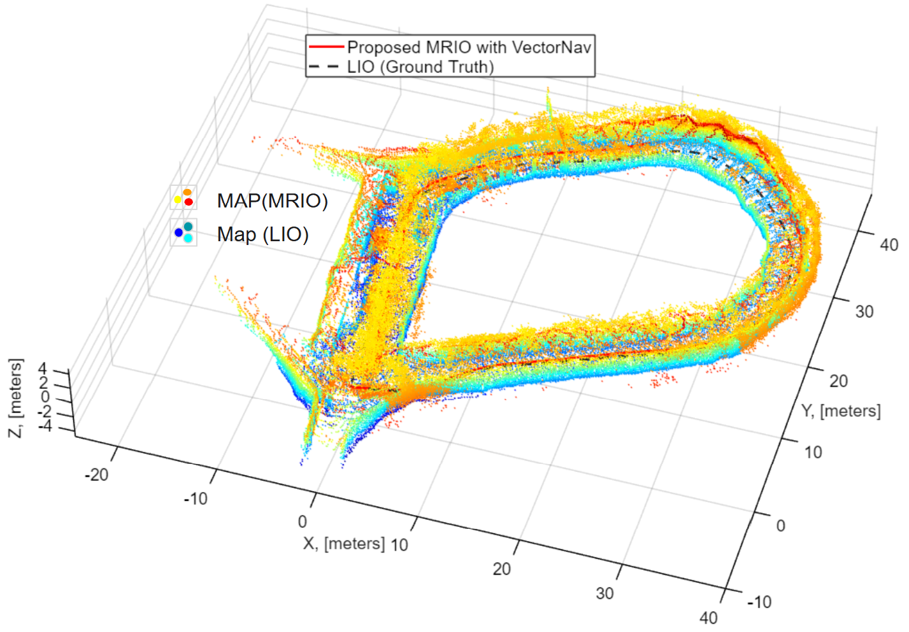

# MRIO
## How IMU Drift Influences Multi-Radar Inertial Odometry for Ground Robots in Subterranean Terrains
#### [[ arXiv ](https:)] [[Video:(https://youtu.be/dJJiGeuZ9-Y)]
<p align="justify">
MRIO is an online radar–inertial odometry framework developed using cost-effective FMCW TI IWR6843AOP ES2 radars arranged in an ensemble configuration and integrated with either a Pixhawk or VectorNav IMU, mounted on a Pioneer 3-AT rover platform. Radars  R_1-R_4 are mounted on the same plane, while R_5-R_6 are installed at slanted angles to capture ceiling observations from both the front and rear directions. Operation in subterranean environments introduces significant challenges, including drift-induced degradation, sparse and noisy radar returns, flickering measurements, and additional IMU drift caused by extreme cold and sloped tunnel terrain. These factors make sensor fusion more unstable compared to LiDAR Inertial Odometry (LIO). However, LiDAR performance deteriorates in the presence of smoke, dust, and aerosols, whereas FMCW radars remain compact, lightweight, cost-effective, and robust under such conditions. To address these challenges, the MRIO framework is proposed that incorporates an IMU bias estimation module to enable resilient localization and mapping in GPS-denied subterranean environments affected by smoke and visibility degradation.
<br>
<p align='center'>
    
</p>

## Dependencies
```

sudo apt-get install python3-sklearn python3-sklearn-lib python-sklearn-doc
sudo apt install ros-${ROS_DISTRO}-tf-transformations

```

## 2-Stage Multi-Radar Inertial Odometry(MRIO)
MRIO adjusts accelerometer bias by estimating and differentiating forward velocity in a first-stage EKF. The corrected ego-velocity generated from stage-I, after differentiation and moving average filtering, is injected into a second-stage EKF, which estimates the pose for the ground mobile robot and the forward velocity of the agent.  
 ## Configuration
The configuration files are found in the `config` folder. It's split into two different yaml files: One containing general parameters (for example, `default.yaml`), and one containing a specific radar setup (for example, `radar_setup_6radars.yaml`). The name of the radar setup file to be used is specified in the general parameter configuration file under the field `radarSetupFile`. It's structured like this to make it easy to try out various radar setups without needing several configuration files for the general parameters.
 ## Sensor requirements
One or more radars with ROS2 drivers publishing `sensor_msgs/PointCloud2` messages, including fields for x, y, z and doppler velocity. The name of the Doppler velocity field is specified as `dopplerVelocityFieldName` in the `radarSetupFile`. An IMU with a ROS2 driver publishing `sensor_msgs/Imu` messages. _Important_: Please note that MRIO relies on the `orientation` field of the message being included through an accurate AHRS, as this information is used in the update step of the second stage EKF.

 ## TF tree
 All the nodes assume that there is a pre-existing TF tree containing static TFs between the frame defined in the parameter `baseLinkFrame` and the various sensor frames. For the Pioneer, there is a launch file in the `launch` folder called `static_tf_launch.py` which publishes the relevant TFs for that platform.

 ## Description of the nodes
 
 Note: Since the topic names can be chosen freely in the parameter file, when a topic is mentioned by name in the upcoming sections, it will refer to the name of the field in the parameter file, rather than the actual name of the ROS 2 topic.
 ### filter_and_merge_pcl.py
 
This node subscribes to the radar PointCloud2 topics defined in the `radarSetupFile`, transforms them to the `baseLinkFrame` (i.e., the body frame of the robot), merges them into a single pointcloud and publishes this at a fixed rate defined by the `radarPublishPeriod` parameter in the `radarSetupFile`. Before merging, the pointclouds can optionally be filtered by an inner and outer radius and/or by a vertical distance (the latter may be useful to discard false detections below ground level). Depending on the value of the boolean `useIndividualRadii`, the filtering radii may be equal for all the radars in the configuration, in which case they are defined in the general parameter file, or defined individually for each radar, in which case they are defined in the `radarSetupFile`.
## RIO block diagram



 ### estimate_ego_velocity_from_doppler.py
This node subscribes to the merged point cloud topic, where the point clouds from individual radars are first filtered based on a predefined sensing radius. The filtered data are then used to estimate ego velocity through a least-squares approach. Within this sensing range, both inner and outer radius thresholds are applied: the inner radius removes points caused by vehicle vibrations during motion, while the outer radius filters out points resulting from false reflections. In this work, we have used TIIWR6843AOP EVM radars, for which RANSAC didn't provide significant benefits.The node publishes the estimated ego velocity vector as a `TwistWithCovarianceStamped` message (on the topic defined by `egoVelocityWithCovTopic`). 

 ## ekf.py
 A general Extended Kalman Filter (EKF). The user must define a `model` class that implements the following four methods:
### State model
#### `systemDynamics(self, x, u, dt)`
Implements the (generally nonlinear) state transition function:

$$
\hat{\mathbf{x}}_k = f(\hat{\mathbf{x}}_{k-1}, \mathbf{u}_{k-1})
$$
#### `getStateTransitionMatrix(self, x, u, dt)`
Returns the Jacobian \( F \) of \( f \) with respect to \( x \).

---
#### `observationFunction(self, x)`
Implements the (generally nonlinear) observation function:

$$
\hat{\mathbf{y}}_k = h(\hat{\mathbf{x}}_k)
$$
#### `getObservationMatrix(self, x)`
Returns the Jacobian \( H \) of \( h \) with respect to \( x \).

---
### EKF methods
#### `predict(self, u, Q, dt)`
Performs the prediction step of the EKF.
#### `update(self, y, R)`
Performs the measurement update step.

Which perform the predict and update steps with the help of the user-defined `model` class, and where `Q` and `R` are the process noise covariance and the measurement noise covariance, respectively. Even in the case that there's a single state, input or output, it's important for the functionality that `x`, `u` and `y` are provided as 1-dimensional numpy arrays, and that the jacobians and covariance matrices are provided as 2-dimensional numpy arrays (e.g., even if there is only a single state, `x` should be an array of shape (1,) and `getStateTransitionMatrix` should return an array of shape (1,1), they can _not_ just be floating point scalars). The x-component of the IMU acceleration and the z-component of the IMU angular velocity are considered as inputs driving the system dynamics, while the estimated ego velocity and the IMU yaw angle are considered as measurements. Since the IMU is publishing at a much higher rate than the radars, there are several `predict` steps in between each `update` step.
<div align="center" style="max-width: 900px; margin: auto;">

  <!-- First (top) figure -->
  

</div>

### ekf_stage1.py

This node subscribes to the `egoVelocityWithCovTopic` and the `imuTopic` specified in the parameter file. It then fuses the x-component of the IMU acceleration with the x-component of the ego velocity vector through an EKF with x-velocity as the only state. The fused x-velocity is then differentiated and run through a moving average filter to produce a bias compensated x-acceleration, which is published as a `Float64` message under the topic specified by `stage1_outputTopic`. The size of the moving average filter is specified in the parameter file.
__ekf_stage1.py__ and __ekf_stage2.py__ may use either the ego velocity covariance estimated from the least squares method, or a fixed constant value, depending on whether the parameter `useEgoVelCovarianceFromMessage` is set to `true` or `false`.

### ekf_stage2.py
This node subscribes to the `egoVelocityWithCovTopic`, the `imuTopic` and the `stage1_outputTopic` and fuses these in a 4-state EKF (the states are x-position, y-position, x-velocity and yaw angle in that order). It publishes the estimated (2D) pose as a `PoseStamped` message under `outputPoseTopic`, the estimated linear and angular velocites as a `TwistStamped` message under `outputTwistTopic`, and a TF from the `odometryFrame` to the `baseLinkFrame`.

### mapping.py
This node subscribes to the radar pointcloud from the `mergedPCLTopic` (if `useRANSAC` is `false`) or the `ransacedPCLTopic` (if `useRANSAC` is `true`). The input pointcloud is transformed from the `baseLinkFrame` to the `odometryFrame` using the TF published by __ekf_stage2.py__, and appended to a pointcloud map, which is published once every 30 input messages under `mapTopic` (Note: The frequency of publishing the map should be left to the user to decide in the parameter file, but is currently hardcoded in __mapping.py__).
 <!-- Bottom row -->
  <div style="display: flex; justify-content: space-between;">
    
    
  </div>

## Launching MRIO
The repository does not include a conventional ROS launch file to start all the nodes. Instead, we supply a [Tmuxinator](https://github.com/tmuxinator/tmuxinator) project file, which is intended to provide a better overview of the output from each node for troubleshooting, and makes it easy to terminate and restart individual nodes if needed.
To launch using the default parameter file:

```
cd mrio/launch
tmuxinator start -p mrio_launch.yml
```
Or with a custom parameter file located in the mrio/config folder:

```
cd mrio/launch
tmuxinator start -p mrio_launch.yml my_custom_config.yaml
```

## License

------------------------------------------------
This work is licensed under the terms of the MIT license
<p align="center">
  
</p>
